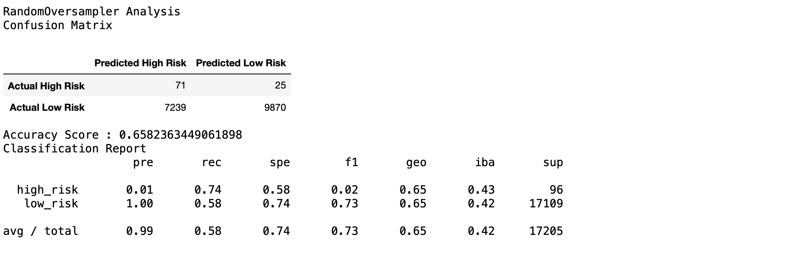
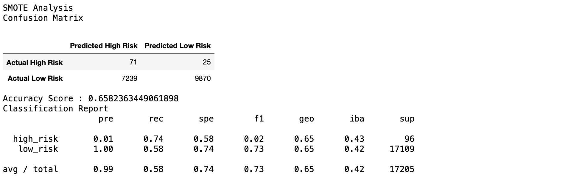
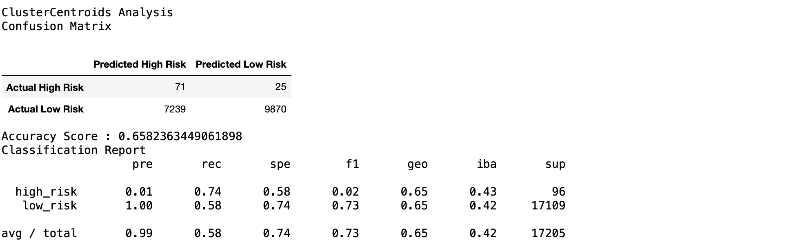
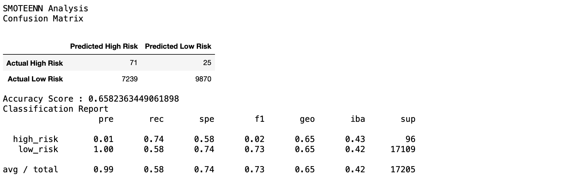
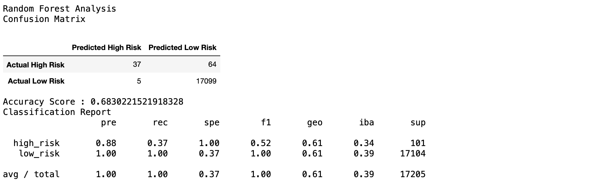
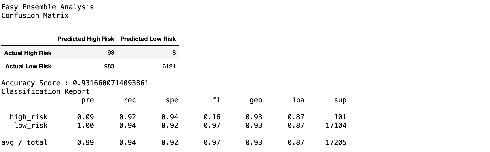

# Credit_Risk_Analysis

## Overview

The purpose of this analysis was to help create a credit risk assessment algorithm. Credit risk is an inherently unbalanced classification problem as good loans easily outnumber risky loans. 

in order to accurately predict credit risk. we used : 

- Naive Random Oversampling
- SMOTE Oversampling
- Cluster Centroid Undersampling
- SMOTEENN Sampling
- Random Forest Classifying
- Easy Ensemble adaBoost Classifier

## Results

With each of these methods we split the data into training and testing datasets, applied the corresponding transformations, and then compiled accuracy scores, confusion matries, and classification reports to showcase the results, here are the results for the different models that have been attempted :

#### Naive Random Oversampling 

#### SMOTE Oversampling

#### Cluster Centroid Undersampling

#### SMOTEENN Sampling

#### Random Forest Classifier

#### AdaBoost 

## Conclusion

after looking at the result of our models we realise that sampling didnt cause much improvement in the models results.

and with respect to the chosen model in this case we chose the Easy Ensemble Classifying model, with the Adaboost algorithm as it does a great job detecting the high risk and thats whats of the most importance to us in this case.
